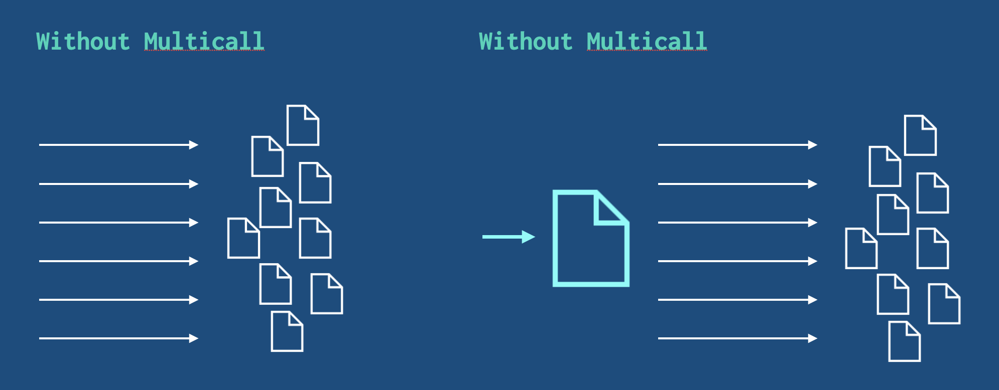

# Multicall

The [Multicall](https://github.com/makerdao/multicall) Smart Contract developed by [MakerDAO](https://makerdao.com/) allows us to make a single call to the contract and get the results of multiple calls.



The contract is deployed on Mainnet, all major Testnets and a lot of other EVM-compatible chains.

The Smart Contract is available and free to use for anyone wanting to reduce the number of calls.

## Why use Multicall

The reduced number of calls to read blockchain data has two main benefits:

1. **For the developer/operator of a DApp** - fewer requests to API providers (such us Infura or Alchemy) means a smaller bill to be paid, or more users served for the same price.
2. **For the user of a DApp** - Less browser HTTP calls to read data means snappier experience using the website. For mobile devices, lower impact on computer resources can translate to less carrier data usage and battery usage.

## Multicall vs Multicall2

[Mutlicall2](https://github.com/makerdao/multicall/blob/master/src/Multicall2.sol) is (obviously) a second, improved version of the Multicall contract.

The most notable feature of Multicall2 is the ability to individually treat execution errors of the requested calls, and still return data for other calls - as opposed to Multicall1 which returned a single error for the whole batched call.

:::info
It is generally recommended to use Multicall version 2, unless there is a good reason not to.
:::

To use Multicall V2 in a useDapp-powered project, all you have to do is set this in our useDApp Config:

```ts
const config: Config = {
  (...)
  multicallVersion: 2 as const,
}
```

---

Now that we have explained the basics of DApps and what a Multicall is, let's dive into what would be the [requirements of a well functioning dApp](./DApp%20Requirements).
