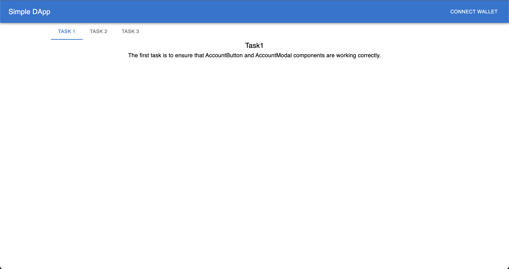

# Setup

In this chapter we'll finally get some hands on experience on building simple DApp using useDApp! We'll start by setting up the template project and taking a look at the code inside it.

## Prerequisites

To be able to follow this tutorial you'll need to have the following installed on your machine:

- [git](https://git-scm.com/)
- [Node.js](https://nodejs.org/)
  - It is recommended to use [LTS or Maintenance version](https://github.com/nodejs/release#release-schedule)
- [yarn](https://classic.yarnpkg.com/)
- [Metamask](https://metamask.io/download/) installed in your browser

## Building the project

Clone the repo:

```bash
git clone https://github.com/yivlad/useDApp-tutorial.git
```

Go to the repo root directory:

```bash
cd useDApp-tutorial
```

Install all dependencies:

```bash
yarn
```

And finally, build the project:

```bash
yarn build
```

## Repo structure

The repo is a yarn workspaces monorepo. Under the `packages` directory you'll find a directory containing the code for the contracts and a directory containing the code for the frontend.

### Contracts

Directory `contracts` contains a package named `@simple-dapp/contracts`. It contains `Solidity` code for `WETH10` and all necessary stuff to deploy it to the local blockchain node. The package provides few commands that you may find useful:

- `yarn start-ganache` - starts a local blockchain node on port `8545`.
- `yarn deploy-local` - deploys the `WETH10` contract to the local blockchain node. The contract address will be printed to the console. The local blockchain node should be running.
- `yarn get-funds` - you can pass in your address as a parameter and get 1 ETH on your account on the local node. The local blockchain node should be running.

[Waffle](https://github.com/TrueFiEng/Waffle) is used here to compile, test and deploy the contracts. `WETH10` contract type and ABI are exported from the package.

### Frontend

Directory frontend contains code for our DApp. This is the package we'll make our changes to during the tutorial. It's a `React` app configured to use `useDApp` and [ethers](https://docs.ethers.io/v5/). The app depends on the package `@simple-dapp/contracts` and uses `WETH10` contract type and ABI.

## Running the project

To run the project you'll need two terminal windows open. In the first one, we'll start a local blockchain node. In the second one, we'll deploy the `WETH10` contract to the local blockchain node and get some funds to be able to send transactions. After that we'll use the same terminal to start the `React` app.

### Starting a local blockchain node

In the first terminal window, go to the `packages/contracts` directory and run:

```bash
yarn start-ganache
```

This will start a local blockchain node on port `8545`. You can see logs produced by the node in the terminal window. The script `yarn start-ganache` uses library called [ganache](https://trufflesuite.com/ganache/) under the hood.

### Deploying the WETH10 contract and getting funds

In the second terminal window, go to the `@simple-dapp/contracts` package.

```bash
cd packages/contracts
```

Deploy the `WETH10` contract to the local blockchain node we started in the previous step.

```bash
yarn deploy-local
```

This will print the address of the deployed contract to the console. Copy the address and paste it into the line 5 of `packages/frontend/src/shared/weth10addresses.ts` file.

````diff
- [Localhost.chainId]: '0xf4BB2e28688e89fCcE3c0580D37d36A7672E8A9F' // TODO: paste the actual address here
+ [Localhost.chainId]: '0xA193E42526F1FEA8C99AF609dcEabf30C1c29fAA'
````

:::info
Note that the address you got from the previous step is probably the same as the one in the code snippet above. This is because the address of the deployed contract is computed based on the address of the deployer account, which is defined in `yarn deploy-local` script, and the number of transactions the account has sent before.
:::

### Getting funds on local network

In this we'll get some funds to be able to send transactions to our local blockchain node. First we need to get our address. Go to your browser and open Metamask. Copy your address.

<p align="center">
  
</p>

After you've copied your address, go back to the terminal window and run (replace `INSERT_YOUR_ADDRESS_HERE` with the address you've copied):

```bash
yarn get-funds INSERT_YOUR_ADDRESS_HERE
```

### Starting the React app

In the terminal window you used in the previous step, go to the `packages/frontend` directory and run `yarn start`. This will start the `React` app on port `8080`.

```bash
cd ../frontend
yarn start
```

Open `http://localhost:8080` in your browser. You should see the following page:



## Summary

In this chapter, you made all the necessary preparations to start doing the exercises. But before starting with the exercises, we will [look into configuration](./Config) of our DApp.
